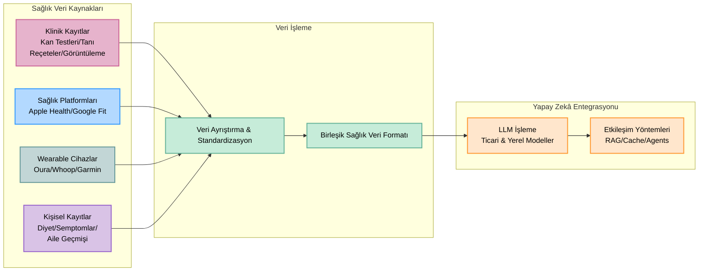

# 🚀 **OpenHealth**

<div align="center">

**Yapay Zekâ Sağlık Asistanı | Verilerinizle Güçlendirilmiş**

<p align="center">
  
  
  
</p>

> **📢 Artık Web’de Kullanılabilir!**  
> OpenHealth’i daha erişilebilir hale getirdik; iki farklı seçenekle:  
> **[Klinik](https://qna.open-health.me/)** - Hızlı ve kolay sağlık danışmanlığı  
> **[Tam Platform](https://www.open-health.me/)** - Kapsamlı sağlık yönetimi için gelişmiş araçlar

### 🌍 Dilinizi Seçin
[English](README.md) | [Français](i18n/readme/README.fr.md) | [Deutsch](i18n/readme/README.de.md) | [Español](i18n/readme/README.es.md) | [한국어](i18n/readme/README.ko.md) | [中文](i18n/readme/README.zh.md) | [日本語](i18n/readme/README.ja.md) | [Українська](i18n/readme/README.uk.md) | [Русский](i18n/readme/README.ru.md) | [اردو](i18n/readme/README.ur.md) | [Türkçe](i18n/readme/README.tr.md)

</div>

---

<p align="center">
  
</p>

## 🌟 Genel Bakış

> OpenHealth, **sağlık verilerinizi kontrol altına almanıza** yardımcı olur.  
> Yapay zekâ ve kişisel sağlık bilgilerinizi kullanarak size özel bir sağlık asistanı sağlar.  
> Maksimum gizlilik için tamamen yerel olarak çalıştırabilirsiniz.

## ✨ Proje Özellikleri

<details open>
<summary><b>Temel Özellikler</b></summary>

- 📊 **Merkezi Sağlık Verisi Girişi:** Tüm sağlık verilerinizi tek bir yerde toplayın.  
- 🛠️ **Akıllı Ayrıştırma:** Verilerinizi otomatik olarak ayrıştırır ve yapılandırılmış dosyalara dönüştürür.  
- 🤝 **Bağlamsal Sohbetler:** Yapılandırılmış verileri GPT destekli kişiselleştirilmiş sohbetlerde kullanın.  

</details>

## 📥 Desteklenen Veri Kaynakları & Dil Modelleri

<table>
  <tr>
    <th>Ekleyebileceğiniz Veri Kaynakları</th>
    <th>Desteklenen Dil Modelleri</th>
  </tr>
  <tr>
    <td>
      • Kan Testi Sonuçları<br>
      • Sağlık Kontrol Verileri<br>
      • Kişisel Fiziksel Bilgiler<br>
      • Aile Geçmişi<br>
      • Semptomlar
    </td>
    <td>
      • LLaMA<br>
      • DeepSeek-V3<br>
      • GPT<br>
      • Claude<br>
      • Gemini
    </td>
  </tr>
</table>

## 🤔 Neden OpenHealth?

> - 💡 **Sağlığınız sizin sorumluluğunuzdur.**  
> - ✅ Gerçek sağlık yönetimi, **verileriniz** + **zeka** birleşiminden doğar ve içgörüleri eyleme dönüştürür.  
> - 🧠 Yapay zekâ, uzun vadeli sağlığınızı etkili bir şekilde yönetmede tarafsız bir araçtır.  

## 🗺️ Proje Diyagramı



> **Not:**  Veri ayrıştırma fonksiyonu şu anda ayrı bir Python sunucusunda uygulanmaktadır. Gelecekte TypeScript’e taşınması planlanmaktadır.

## Başlangıç

## ⚙️ OpenHealth Nasıl Çalıştırılır

<details open>
<summary><b>Kurulum Talimatları</b></summary>

1. **Depoyu Klonlayın:**
   ```bash
   git clone https://github.com/OpenHealthForAll/open-health.git
   cd open-health
   ```

2. **Kurulum ve Çalıştırma:**
   ```bash
   # Ortam dosyasını kopyalayın
   cp .env.example .env

   # Docker/Podman Compose ile başlatın
   docker/podman compose --env-file .env up
   ```

   Mevcut kullanıcılar için:
   ```bash
   # .env dosyası için ENCRYPTION_KEY oluşturun:
   # Çıktıyı .env içindeki ENCRYPTION_KEY alanına ekleyin
   echo $(head -c 32 /dev/urandom | base64)

   # Uygulamayı yeniden oluşturup başlatın
   docker/podman compose --env-file .env up --build
   ```
   to rebuild the image. Run this also if you make any modifications to the .env file.

3. **OpenHealth’e Erişim:**
   Tarayıcınızdan `http://localhost:3000` adresine giderek OpenHealth’i kullanmaya başlayabilirsiniz.

> **Note:** Sistem iki ana bileşenden oluşur: ayrıştırma ve LLM. Ayrıştırma için docling kullanabilirsiniz, LLM bileşeni ise Ollama ile tamamen yerel çalıştırılabilir.

> **Note:** Docker ile Ollama kullanıyorsanız, API endpoint’inizi şu şekilde ayarlayın: Mac: `http://docker.for.mac.localhost:11434` ya da Windows: `http://host.docker.internal:11434`.

</details>

---

## Yıldız Geçmişi

[](https://star-history.com/#OpenHealthForAll/open-health&Date)

---

## 🌐 Topluluk ve Destek

<div align="center">

### 💫 Hikayeni Paylaş | Güncellemeleri Takip Et | Geri Bildirim Ver
[](https://www.reddit.com/r/AIDoctor/)
[](https://discord.gg/B9K654g4wf)

### 🤝 Ekip ile İletişime Geç
[](https://calendly.com/open-health/30min)
[](mailto:sj@open-health.me)

</div>

