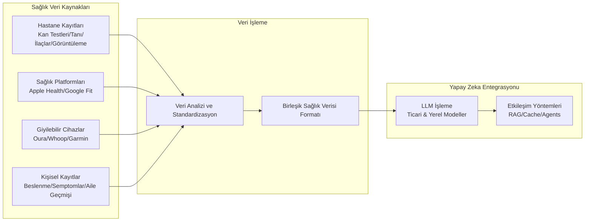

# 🚀 **OpenHealth**

<div align="center">

**Yapay Zeka Sağlık Asistanı | Verilerinizle Güçlendirilmiş, Yerel Olarak Çalışır**

<p align="center">
  
  
  
</p>

> **📢 Artık Web'de Kullanılabilir!**  
> Daha kolay erişim taleplerine yanıt olarak, web sürümünü yayınladık.  
> Hemen deneyin: **[open-health.me](https://open-health.me/)**

### 🌍 Dil Seçenekleri
[Türkçe](i18n/readme/README.tr.md) | [İngilizce](README.md) | [Français](i18n/readme/README.fr.md) | [Deutsch](i18n/readme/README.de.md) | [Español](i18n/readme/README.es.md) | [한국어](i18n/readme/README.ko.md) | [中文](i18n/readme/README.zh.md) | [日本語](i18n/readme/README.ja.md) | [Українська](i18n/readme/README.uk.md) | [Русский](i18n/readme/README.ru.md) | [اردو](i18n/readme/README.ur.md)

</div>

---

<p align="center">
  
</p>

## 🌟 Genel Bakış

> OpenHealth, **sağlık verilerinizin kontrolünü elinize almanıza yardımcı olur**. Yapay zeka ve kişisel sağlık bilgilerinizi kullanarak, OpenHealth size özel bir sağlık asistanı sunar. Üstelik tüm işlemler **yerel olarak çalışır** ve **tamamen gizlidir**.

## ✨ Proje Özellikleri

<details open>
<summary><b>Temel Özellikler</b></summary>

- 📊 **Merkezi Sağlık Verisi Girişi:** Tüm sağlık verilerinizi tek bir yerde toplayın.
- 🛠️ **Akıllı Veri İşleme:** Sağlık verilerinizi otomatik olarak analiz ederek yapılandırılmış veri dosyaları oluşturur.
- 🤝 **Bağlamsal Konuşmalar:** Yapay zeka destekli asistan, yapılandırılmış verileriniz ile kişiselleştirilmiş yanıtlar üretir.

</details>

## 📥 Desteklenen Veri Kaynakları & Dil Modelleri

<table>
  <tr>
    <th>Ekleyebileceğiniz Veri Kaynakları</th>
    <th>Desteklenen Dil Modelleri</th>
  </tr>
  <tr>
    <td>
      • Kan Testi Sonuçları<br>
      • Genel Sağlık Taramaları<br>
      • Kişisel Fiziksel Bilgiler<br>
      • Aile Geçmişi<br>
      • Semptomlar
    </td>
    <td>
      • LLaMA<br>
      • DeepSeek-V3<br>
      • GPT<br>
      • Claude<br>
      • Gemini
    </td>
  </tr>
</table>

## 🤔 OpenHealth Neden Geliştirildi?

> - 💡 **Sağlığınız sizin sorumluluğunuzdadır.**
> - ✅ Gerçek sağlık yönetimi, **verileriniz** + **yapay zeka** kombinasyonu ile içgörüleri eyleme dökerek sağlanır.
> - 🧠 Yapay zeka, sağlığınızı uzun vadeli olarak yönetmenize yardımcı olan tarafsız bir araçtır.

## 🗺️ Proje Diyagramı



> **Not:** Veri işleme özellikleri şu anda ayrı bir Python sunucusunda çalışmaktadır, ancak ilerleyen süreçte TypeScript'e taşınması planlanmaktadır.

## 🚀 Başlarken

## ⚙️ OpenHealth Nasıl Çalıştırılır?

<details open>
<summary><b>Kurulum Talimatları</b></summary>

1. **Depoyu Klonlayın:**
   ```bash
   git clone https://github.com/OpenHealthForAll/open-health.git
   cd open-health
   ```

2. **Kurulum ve Çalıştırma:**
   ```bash
   # Çevre dosyasını oluşturun
   cp .env.example .env

   # API anahtarlarını .env dosyasına ekleyin:
   # UPSTAGE_API_KEY - Veri işleme için (https://www.upstage.ai adresinden ücretsiz $10 kredi alabilirsiniz)
   # OPENAI_API_KEY - Gelişmiş analiz için

   # Uygulamayı Docker Compose ile başlatın
   docker compose --env-file .env up
   ```

   Eğer zaten kuruluysa:
   ```bash
   docker compose --env-file .env up --build
   ```
   komutunu çalıştırarak yeni yapılandırmaları uygulayabilirsiniz.

3. **OpenHealth'e Erişim:**
   Tarayıcınızda `http://localhost:3000` adresini açarak OpenHealth'i kullanmaya başlayabilirsiniz.

> **Not:** Sistem iki ana bileşenden oluşur: veri işleme ve yapay zeka. Şu anda veri işleme için Upstage ve OpenAI API'leri kullanılmaktadır. Gelecekte yerel bir analiz aracı eklenecektir. Yapay zeka bileşeni ise tamamen yerel olarak **Ollama** kullanılarak çalıştırılabilir.

> **Not:** Eğer Docker ile Ollama kullanıyorsanız, Mac için `http://docker.for.mac.localhost:11434/`, Windows için `http://host.docker.internal:11434/` API uç noktasını kullanmalısınız.

</details>

---

## ⭐ Yıldız Geçmişi

[](https://star-history.com/#OpenHealthForAll/open-health&Date)

---

## 🌐 Topluluk ve Destek

<div align="center">

### 💫 Hikayenizi Paylaşın & Geri Bildirim Verin
[](https://www.reddit.com/r/AIDoctor/)
[](https://discord.gg/B9K654g4wf)

</div>